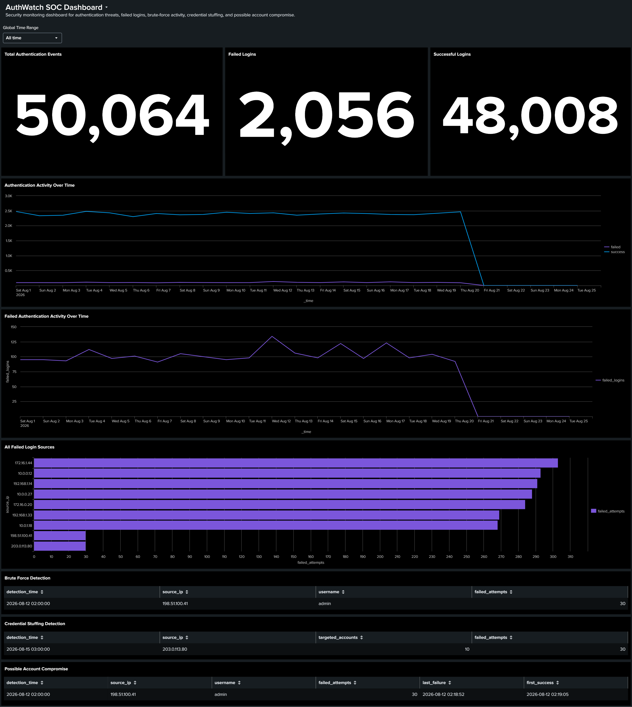
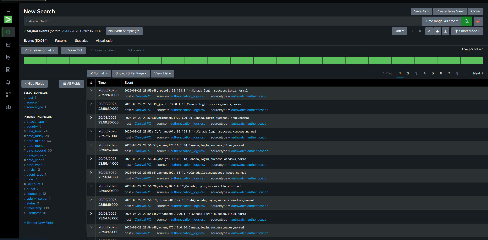

# AuthWatch

[](https://github.com/RipLiquid/AuthWatch/actions/workflows/ci.yml)

**Security Threat Detection & SIEM Analytics Platform**

AuthWatch is a cybersecurity analytics project built with **Python, SQL, SQLite, Splunk, SPL, and GitHub Actions**.

The project generates synthetic authentication logs, stores and analyzes them using SQLite and SQL, ingests the events into Splunk, detects suspicious authentication behaviour, correlates security events, and visualizes the results through a SOC-style dashboard.

AuthWatch also includes an automated **CI/CD pipeline** that validates the security analytics pipeline across multiple Python versions and supports tag-triggered GitHub releases.

---

## Dashboard



The AuthWatch SOC Dashboard was created using **Splunk Dashboard Studio** and provides a centralized view of authentication activity, failed login trends, suspicious source IPs, and detected attack patterns.

---

## Key Features

- Generates **50,064 synthetic authentication events**
- Stores authentication data in a SQLite database
- Performs security analytics using SQL
- Ingests structured authentication logs into Splunk
- Uses custom **SPL threat-detection queries**
- Detects brute-force authentication attacks
- Detects credential-stuffing activity
- Correlates failed authentication attempts with subsequent successful logins
- Visualizes authentication activity over time
- Identifies failed-login source IPs
- Provides a SOC-style Splunk monitoring dashboard
- Uses behaviour-based detections instead of relying on attack labels
- Includes automated Python pipeline tests
- Runs CI automatically on pushes and pull requests
- Tests against Python **3.12, 3.13, and 3.14**
- Includes a tag-triggered GitHub release workflow

---

## Technologies

### Security & Analytics

- Splunk Enterprise
- Splunk Search Processing Language (SPL)
- SIEM Analytics
- Security Log Analysis
- Event Correlation
- Threat Detection
- Threat Hunting

### Development

- Python
- SQL
- SQLite
- Git
- GitHub
- GitHub Actions
- Python `unittest`

---

## Project Architecture

```text
                         AuthWatch
                             |
                      Python Generator
                             |
                             v
                  authentication_logs.csv
                       /             \
                      /               \
                     v                 v
                 SQLite              Splunk
                    |                   |
                    v                   v
                   SQL                 SPL
                    |                   |
                    v                   v
             Threat Detection    Threat Detection
                      \              /
                       \            /
                        v          v
                      Security Analysis
                             |
                             v
                     SOC Dashboard


Developer Push / Pull Request
             |
             v
      GitHub Actions CI
             |
       +-----+-----+
       |     |     |
       v     v     v
     3.12  3.13  3.14
       |     |     |
       +-----+-----+
             |
             v
    Generate Authentication Logs
             |
             v
      Build SQLite Database
             |
             v
       Run Threat Detections
             |
             v
       Run Automated Tests
             |
             v
          PASS / FAIL


Version Tag (v*)
       |
       v
Release Validation
       |
       v
Automated Tests
       |
       v
Package AuthWatch
       |
       v
GitHub Release
```

---

## Project Structure

```text
AuthWatch/
├── .github/
│   └── workflows/
│       ├── ci.yml
│       └── release.yml
│
├── images/
│   ├── authwatch_soc_dashboard.png
│   ├── authwatch_detections.png
│   └── splunk_portal.png
│
├── sql/
│   └── detection_queries.sql
│
├── src/
│   ├── generate_logs.py
│   ├── init_db.py
│   └── run_detections.py
│
├── tests/
│   └── test_pipeline.py
│
├── .gitignore
└── README.md
```

The `data/` directory is created locally when the project runs.

Generated files such as:

```text
data/authentication_logs.csv
data/authwatch.db
```

are excluded from version control because they can be recreated using the included Python scripts.

---

# Dataset

AuthWatch generates **50,064 authentication events** representing a combination of normal user activity and simulated suspicious authentication behaviour.

Each authentication event contains:

```text
timestamp
username
source_ip
country
event_type
status
device
attack_type
```

Example event:

```text
2026-08-12 02:15:00,admin,198.51.100.41,Germany,login,failed,linux,brute_force
```

The `attack_type` field exists only as **ground truth for validating the synthetic dataset**.

The SQL and SPL threat-detection logic does **not** use the `attack_type` field to identify suspicious events.

Instead, attacks are detected using observable authentication behaviour such as:

- Failed login frequency
- Time windows
- Source IP
- Username
- Distinct account count
- Failed-to-success authentication sequences

This allows the project to demonstrate behaviour-based threat detection rather than simply filtering pre-labeled attack data.

---

# Threat Detection

## 1. Brute-Force Detection

AuthWatch detects repeated failed authentication attempts against the same account from the same source IP within a one-hour period.

### Detection Logic

```text
Same Source IP
       +
Same Username
       +
5 or More Failed Attempts
       +
Within One Hour
       |
       v
Possible Brute-Force Attack
```

Detected simulated attack:

```text
Detection Time:  2026-08-12 02:00:00
Source IP:       198.51.100.41
Username:        admin
Failed Attempts: 30
```

### SPL Detection

```spl
index=authwatch status="failed"
| bin _time span=1h
| stats count AS failed_attempts BY _time source_ip username
| where failed_attempts >= 5
| eval detection_time=strftime(_time,"%Y-%m-%d %H:%M:%S")
| table detection_time source_ip username failed_attempts
| sort - failed_attempts
```

---

## 2. Credential-Stuffing Detection

Credential stuffing differs from traditional brute force because one source attempts authentication against **multiple different accounts**.

### Detection Logic

```text
Same Source IP
       +
Failed Authentication Attempts
       +
5 or More Distinct Usernames
       +
Within One Hour
       |
       v
Possible Credential-Stuffing Attack
```

Detected simulated activity:

```text
Detection Time:    2026-08-15 03:00:00
Source IP:         203.0.113.80
Accounts Targeted: 10
Failed Attempts:   30
```

### SPL Detection

```spl
index=authwatch status="failed"
| bin _time span=1h
| stats dc(username) AS targeted_accounts count AS failed_attempts BY _time source_ip
| where targeted_accounts >= 5
| eval detection_time=strftime(_time,"%Y-%m-%d %H:%M:%S")
| table detection_time source_ip targeted_accounts failed_attempts
| sort - targeted_accounts
```

---

## 3. Possible Account Compromise

AuthWatch performs event correlation to identify repeated failed authentication attempts followed by a successful login from the **same source IP and user account**.

Detected activity:

```text
Source IP:       198.51.100.41
Username:        admin
Failed Attempts: 30

Last Failure:
2026-08-12 02:18:52

Successful Login:
2026-08-12 02:19:05
```

The successful authentication occurred only **13 seconds after the final failed attempt**.

### Detection Sequence

```text
30 Failed Authentication Attempts
               |
               v
       Same Source IP
               +
         Same Username
               |
               v
      Successful Login
        13 Seconds Later
               |
               v
   Possible Account Compromise
```

### SPL Detection

```spl
index=authwatch
| eval event_time=_time
| bin _time span=1h
| stats
    count(eval(status="failed")) AS failed_attempts
    max(eval(if(status="failed", event_time, null()))) AS last_failure
    min(eval(if(status="success", event_time, null()))) AS first_success
    BY _time source_ip username
| where failed_attempts >= 5
    AND isnotnull(first_success)
    AND first_success > last_failure
| eval detection_time=strftime(_time,"%Y-%m-%d %H:%M:%S"),
       last_failure=strftime(last_failure,"%Y-%m-%d %H:%M:%S"),
       first_success=strftime(first_success,"%Y-%m-%d %H:%M:%S")
| table detection_time source_ip username failed_attempts last_failure first_success
| sort - failed_attempts
```

---

# Detection Results



AuthWatch successfully identifies three major suspicious authentication patterns:

| Detection | Source IP | Target | Result |
|---|---|---|---|
| Brute Force | `198.51.100.41` | `admin` | 30 failed attempts |
| Credential Stuffing | `203.0.113.80` | 10 accounts | 30 failed attempts |
| Possible Account Compromise | `198.51.100.41` | `admin` | 30 failures followed by successful authentication |

---

# SOC Dashboard

The AuthWatch SOC Dashboard was created using **Splunk Dashboard Studio**.

The dashboard provides both high-level security metrics and detailed detection results.

## Authentication Overview

The dashboard displays:

```text
Total Authentication Events: 50,064

Successful Logins: 48,008

Failed Logins: 2,056
```

---

## Authentication Activity

The dashboard visualizes:

- Total authentication activity over time
- Successful authentication activity
- Failed authentication activity
- Failed-login trends
- Authentication spikes

These visualizations provide context for investigating unusual authentication behaviour.

---

## Failed Login Sources

A horizontal bar chart compares failed authentication activity across source IP addresses.

An important observation from the dataset is that some legitimate internal IP addresses accumulate more failed logins over the entire dataset than the simulated attacker IPs.

This demonstrates why **raw failed-login counts alone are not sufficient for reliable threat detection**.

AuthWatch therefore combines multiple behavioural indicators:

```text
Time Window
     +
Source IP
     +
Username
     +
Distinct Accounts
     +
Authentication Status
     +
Event Sequence
```

This reduces false positives and produces more meaningful security detections.

---

## Threat Detection Panels

The dashboard contains dedicated investigation tables for:

- Brute-Force Detection
- Credential-Stuffing Detection
- Possible Account Compromise

These panels allow an analyst to quickly identify:

```text
When the activity occurred
Which source IP generated it
Which account was targeted
How many failures occurred
Whether a successful authentication followed
```

---

# Splunk Configuration

The generated authentication dataset is ingested into Splunk using:

```text
Index:
authwatch

Source Type:
authwatch:authentication
```

The structured CSV allows Splunk to extract fields including:

```text
timestamp
username
source_ip
country
event_type
status
device
attack_type
```

The authentication timestamp is mapped to Splunk's `_time` field, enabling:

- Time-series analytics
- Time-windowed detections
- Event correlation
- Security dashboards
- SPL threat hunting

---

# SQL Analysis

AuthWatch implements similar detection logic directly against the SQLite database.

Example brute-force detection:

```sql
SELECT
    strftime('%Y-%m-%d %H:00:00', timestamp) AS hour_bucket,
    source_ip,
    username,
    COUNT(*) AS failed_attempts
FROM security_events
WHERE status = 'failed'
GROUP BY hour_bucket, source_ip, username
HAVING COUNT(*) >= 5
ORDER BY failed_attempts DESC;
```

This allows the same authentication dataset to be investigated using two different analytics approaches:

```text
           Authentication Logs
                  |
          +-------+-------+
          |               |
          v               v
     SQL / SQLite     Splunk / SPL
          |               |
          v               v
   Query-Based       SIEM-Based
     Analysis         Analysis
          |               |
          +-------+-------+
                  |
                  v
          Threat Detection
```

---

# Automated Testing

AuthWatch includes automated tests using Python's built-in `unittest` framework.

The test suite validates the expected security behaviour of the pipeline.

Current tests verify:

```text
Total Event Count
        |
        v
Expected: 50,064 events


Brute-Force Detection
        |
        v
198.51.100.41
admin
30 failed attempts


Credential-Stuffing Detection
        |
        v
203.0.113.80
10 targeted accounts
30 failed attempts


Account Compromise Sequence
        |
        v
Successful authentication after brute-force activity
```

Run the tests locally using:

```bash
python -m unittest discover -s tests -v
```

Expected result:

```text
test_account_compromise_sequence ... ok
test_brute_force_detection ... ok
test_credential_stuffing_detection ... ok
test_total_event_count ... ok

----------------------------------------------------------------------
Ran 4 tests

OK
```

---

# Continuous Integration

AuthWatch uses **GitHub Actions** for Continuous Integration.

The CI workflow automatically runs when:

```text
Code is pushed to main
        OR
A pull request targets main
        OR
The workflow is manually triggered
```

The workflow tests AuthWatch across:

```text
Python 3.12
Python 3.13
Python 3.14
```

For each Python version, GitHub Actions performs:

```text
Checkout Repository
        |
        v
Set Up Python
        |
        v
Generate Authentication Logs
        |
        v
Build SQLite Database
        |
        v
Run AuthWatch Detections
        |
        v
Run Automated Tests
        |
        v
PASS / FAIL
```

This ensures that the complete AuthWatch security analytics pipeline remains reproducible and functional after code changes.

The workflow is located at:

```text
.github/workflows/ci.yml
```

---

# Continuous Delivery

AuthWatch also includes a **GitHub Actions release workflow**.

The release workflow is triggered when a Git version tag matching:

```text
v*
```

is pushed.

Example:

```bash
git tag v1.0.0
git push origin v1.0.0
```

Before creating a release, GitHub Actions automatically:

```text
Checkout Repository
        |
        v
Set Up Python
        |
        v
Generate Authentication Logs
        |
        v
Build SQLite Database
        |
        v
Run Automated Tests
        |
        v
Validate Release
```

If validation succeeds, the workflow packages:

```text
src/
sql/
images/
README.md
.gitignore
```

into a versioned archive.

Example:

```text
AuthWatch-v1.0.0.zip
```

The workflow then creates a GitHub Release with automatically generated release notes.

The release workflow is located at:

```text
.github/workflows/release.yml
```

---

# Running AuthWatch

## 1. Clone the Repository

```bash
git clone https://github.com/RipLiquid/AuthWatch.git
cd AuthWatch
```

---

## 2. Generate Authentication Logs

```bash
python src/generate_logs.py
```

Expected:

```text
Created 50,064 authentication events.
```

The generated dataset is saved to:

```text
data/authentication_logs.csv
```

---

## 3. Build the SQLite Database

```bash
python src/init_db.py
```

Expected:

```text
Loaded 50,064 events into data/authwatch.db
```

---

## 4. Run Threat Detections

```bash
python src/run_detections.py
```

Example output:

```text
=== AUTHWATCH SECURITY ANALYSIS ===

Total authentication events: 50,064

=== POSSIBLE BRUTE-FORCE ATTACKS ===

IP: 198.51.100.41
User: admin
Failed Attempts: 30

=== POSSIBLE CREDENTIAL-STUFFING ATTACKS ===

IP: 203.0.113.80
Accounts Targeted: 10
Failed Attempts: 30

=== POSSIBLE ACCOUNT COMPROMISE ===

IP: 198.51.100.41
User: admin
Failed Attempts: 30
```

---

## 5. Run Automated Tests

```bash
python -m unittest discover -s tests -v
```

---

# CI/CD Workflow

The complete development workflow is:

```text
Developer Changes Code
        |
        v
      Git
        |
        v
    git push
        |
        v
GitHub Repository
        |
        v
 GitHub Actions CI
        |
        +----------------------+
        |                      |
        v                      v
Generate Dataset          Build Database
        |                      |
        +----------+-----------+
                   |
                   v
            Run Detections
                   |
                   v
            Automated Tests
                   |
             +-----+-----+
             |           |
             v           v
           PASS         FAIL
             |
             v
        Merge / Continue
             |
             v
       Version Tag v*
             |
             v
       Release Workflow
             |
             v
      Validate Pipeline
             |
             v
       Package Project
             |
             v
        GitHub Release
```

---

# Security Concepts Demonstrated

AuthWatch demonstrates practical experience with:

- Security Information and Event Management (SIEM)
- Authentication log analysis
- Security monitoring
- Threat detection
- Threat hunting
- Brute-force detection
- Credential-stuffing detection
- Event correlation
- Behaviour-based detection
- Authentication anomaly analysis
- Time-window analysis
- Source-IP analysis
- False-positive reduction
- SQL aggregation
- SPL queries
- Structured log ingestion
- Security dashboards
- Incident investigation concepts
- Data preprocessing
- Automated testing
- Continuous Integration
- Continuous Delivery
- GitHub Actions
- Release automation

---

# Synthetic Data and Safety

All authentication activity used by AuthWatch is **synthetic** and was generated specifically for educational and portfolio purposes.

No real:

- User accounts
- Passwords
- Credentials
- Enterprise authentication systems
- Production systems
- Attack infrastructure

are used.

The project uses private and documentation-only IP address ranges to avoid representing real-world attack infrastructure.

---

# Results

AuthWatch successfully processes:

```text
50,064 Authentication Events
```

and identifies:

### Brute Force

```text
198.51.100.41
        |
        v
      admin
        |
        v
30 Failed Attempts
```

### Credential Stuffing

```text
203.0.113.80
        |
        v
10 Accounts Targeted
        |
        v
30 Failed Attempts
```

### Possible Account Compromise

```text
198.51.100.41
        |
        v
      admin
        |
        v
30 Failed Attempts
        |
        v
Successful Authentication
13 Seconds Later
```

The same attack behaviours can be analyzed through both:

```text
SQL / SQLite
     +
Splunk / SPL
```

and the complete Python pipeline is automatically validated through GitHub Actions.

---